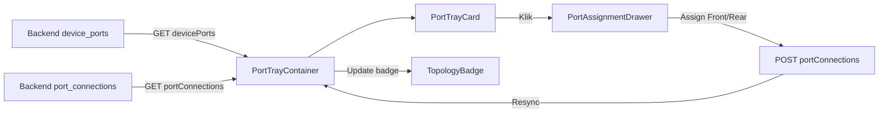
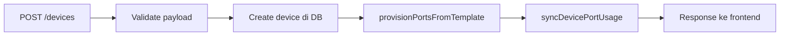

# Topology Create Flow Redesign — Plan, Todo & Checklist

> **Dibuat:** 2026-07-08
> **Tujuan:** Menyederhanakan form create device dengan menghapus field port usage abstrak, menambahkan relasi front/rear port dan cable connection langsung di create form, serta membangun visual port tray untuk manajemen topology di detail form.

---

## 📋 Ringkasan Masalah

### Masalah Saat Ini

1. **Field `used_ports`, `total_ports`, `used_core` di create form adalah tebakan** — nilainya baru diketahui saat port benar-benar terhubung di lapangan
2. **Setup topology sangat sulit** — harus melalui dropdown combobox di detail form, tidak visual, tidak intuitif
3. **Relasi topology tidak terbangun saat create** — user create device, lalu harus manual setup topology di detail form (2 langkah terpisah)

### Solusi yang Diusulkan

| Aspek | Sebelum | Sesudah |
|:------|:--------|:--------|
| **Create form** | `total_ports`, `used_ports`, `used_core` (angka abstrak) | Front port → device, Cable connection, Rear port → device (relasi nyata) |
| **Detail form** | Dropdown combobox untuk topology | Visual port tray dengan badge status + drawer |
| **Auto-populate** | Tidak ada | Jika device referensi sudah punya rear port, front port terisi otomatis |
| **Port usage** | Manual entry angka | Otomatis dari jumlah port yang terassign |

---

## 🎯 Fase Implementasi

### Fase 1: Create Form Simplification (Prioritas #1)

**Goal:** Hapus field abstrak, tambah relasi nyata (front port → device, cable connection, rear port → device)

| Device | Front Port → | Cable | Rear Port → |
|:-------|:-------------|:------|:------------|
| **OTB** | OLT/SWITCH | Backbone/Feeder (ikuti project & POP) | ODC/JC |
| **ODC** | OTB (auto jika OTB sudah setup rear) | Distribution (bisa add new >1) | ODP (via detail form) |
| **ODP** | ODC (auto jika ODC sudah setup rear) | — | ONT-Customer (via detail form) |
| **JC** | OTB | — | HH/MH (via detail form) |
| **CABLE** | Device A | Sesuai route type | Device B |

### Fase 2: Visual Port Tray & Auto-Generate (Setelah Fase 1)

**Goal:** Bangun port tray interaktif seperti ODP Operations untuk OTB, ODC, JC, OLT, SWITCH dengan auto-generate tray/port layout dari template.

#### 2a. Visual Port Tray

**Goal:** Bangun port tray interaktif seperti ODP Operations untuk OTB, ODC, JC, OLT, SWITCH.

**Prinsip:**
- ✅ **Bangun komponen baru, tidak perlu ubah kode existing** — `DevicePortSummarySection`, `DeviceTechnicalSummarySection`, `DeviceTopologyChainVisualizer` tetap utuh sampai Fase 2b
- ✅ **Ikut pola ODP (`OdpPortSection`)** — komponen standalone, props-based, reusable
- ✅ **GT endpoint yang sama** — `GET /topology/devices/:id/summary` sudah return ports + connections
- ✅ **Warna status identik dengan ODP** — konsisten secara visual

**Referensi Visual — ODP Port Section (Saat Ini):**

```
┌──────────────────────────────────────────────────┐
│  Port ODP                    ● used ● idle       │
├──────────────────────────────────────────────────┤
│ ┌────────────┐  ┌────────────┐  ┌────────────┐  │
│ │ Port #1    │  │ Port #2    │  │ Port #3    │  │
│ │ ● used     │  │ ● idle     │  │ ● idle     │  │
│ │ CID: C-001 │  │ CID: -     │  │ CID: -     │  │
│ │ Customer   │  │            │  │            │  │
│ │ ONT-001    │  │            │  │            │  │
│ │ ┌────────┐ │  │ ┌────────┐ │  │ ┌────────┐ │  │
│ │ │status ▾│ │  │ │status ▾│ │  │ │status ▾│ │  │
│ │ └────────┘ │  │ └────────┘ │  │ └────────┘ │  │
│ └────────────┘  └────────────┘  └────────────┘  │
└──────────────────────────────────────────────────┘
```

**Target Visual — Port Tray (OTB — 96 Core = 8 Tray × 12 Port + TIA/EIA-598 Stripe):**

```
┌──────────────────────────────────────────────────────────────────┐
│ Port OTB                                       96 total         │
├──────────────────────────────────────────────────────────────────┤
│ 🖥 Tray A (Port 1-12)         ● 3 used / 8 idle / 1 down       │
├──────────────────────────────────────────────────────────────────┤
│ ┌─╴┐ ┌─╴┐ ┌─╴┐ ┌─╴┐ ┌─╴┐ ┌─╴┐  ┌─╴┐ ┌─╴┐ ┌─╴┐ ┌─╴┐ ┌─╴┐ ┌─╴┐│
│ │ 1│ │ 2│ │ 3│ │ 4│ │ 5│ │ 6│  │ 7│ │ 8│ │ 9│ │10│ │11│ │12││
│ │ ●│ │ ●│ │ ○│ │ ○│ │ ○│ │ ○│  │ ○│ │ ○│ │ ○│ │❌│ │ ○│ │ ○││
│ │ █│ │ █│ │ █│ │ █│ │ █│ │ █│  │ █│ │ █│ │ █│ │ █│ │ █│ │ █││
│ └─╴┘ └─╴┘ └─╴┘ └─╴┘ └─╴┘ └─╴┘  └─╴┘ └─╴┘ └─╴┘ └─╴┘ └─╴┘ └─╴┘│
│  █ = fiber color stripe (TIA/EIA-598)                          │
│  ● used · ○ idle · ❌ down                                     │
├──────────────────────────────────────────────────────────────────┤
│ 🖥 Tray B (Port 13-24)        ● 2 used / 10 idle               │
├──────────────────────────────────────────────────────────────────┤
│ ...                                                              │
├──────────────────────────────────────────────────────────────────┤
│ 🖥 Tray H (Port 85-96)        ● 0 used / 12 idle               │
├──────────────────────────────────────────────────────────────────┤
│ ...                                                              │
└──────────────────────────────────────────────────────────────────┘
│ Klik port idle → [PortAssignmentDrawer]                           │
│   ┌──────────────────────────────────────────────────────────┐   │
│   │ ⚡ Port #1 · Status: idle · Fiber #1: Blue               │   │
│   │                                                          │   │
│   │ Set as: [Front Port] [Rear Port]                         │   │
│   │                                                          │   │
│   │ Cari device: ┌────────────────────┐                      │   │
│   │              │ OLT-001 ▾          │                      │   │
│   │              └────────────────────┘                      │   │
│   │ Pilih port:  ┌────────────────────┐                      │   │
│   │              │ Port #1 (idle) ▾   │                      │   │
│   │              └────────────────────┘                      │   │
│   │                                                          │   │
│   │ [Simpan]                         [Batal]                 │   │
│   └──────────────────────────────────────────────────────────┘   │
└──────────────────────────────────────────────────────────────────┘
```

**Komponen:**

| Komponen | Props | Fungsi |
|:---------|:------|:-------|
| `PortTrayContainer` | `devicePorts: DevicePort[]`, `connections?: PortConnection[]`, **`totalPorts?: number`**, **`deviceTypeKey?: string`**, `layoutConfig?: TrayLayoutConfig`, `loading?: boolean`, `onPortClick: (port) => void` | Container utama: resolve layout dinamis dari `deviceTypeKey+totalPorts`, group port per tray, render grid + fiber color stripe |
| `PortTrayCard` | `port: DevicePort`, `connection?: PortConnection`, **`fiberColor?: FiberColor`** (auto dari port_index jika tidak diisi), `onClick`, `size?: 'sm'|'md'` | Kartu port: **stripe kiri 3px warna TIA/EIA-598**, badge core #, status dot, hover Assign overlay |
| `PortAssignmentDrawer` | `open`, `port`, `deviceTypeKey`, `direction: 'front'|'rear'`, `peerDevices`, `peerPorts`, `onAssign`, `onDisconnect?`, `loading`, `existingConnection?` | Slide-over Sheet: toggle Front/Rear, combobox device + port, info koneksi existing |
| `PortTrayBadge` | `totalPorts`, `usedCount`, `idleCount`, `reservedCount`, `downCount?` | Statistik per tray dengan dot warna |

**Status Port & Warna (identik ODP):**

| Status | Warna | CSS Class (dari ODP) | Makna |
|:-------|:------|:---------------------|:------|
| `idle` | Gray | `bg-slate-300` | Port tersedia, belum terhubung |
| `used` | Green | `bg-emerald-500` | Port terhubung ke device lain |
| `reserved` | Amber | `bg-amber-400` | Port dicadangkan (ekspansi) |
| `down` / `faulty` | Red | `bg-rose-500` | Port rusak / down |

**TIA/EIA-598 Fiber Color Code — Stripe Kiri Card:**

| Core # | Warna | Tailwind Class | Core # | Warna | Tailwind Class |
|:------:|:------|:---------------|:------:|:------|:---------------|
| 1 | Blue | `bg-blue-600` | 7 | Red | `bg-red-600` |
| 2 | Orange | `bg-orange-600` | 8 | Black | `bg-neutral-900` |
| 3 | Green | `bg-green-600` | 9 | Yellow | `bg-yellow-500` |
| 4 | Brown | `bg-amber-800` | 10 | Violet | `bg-purple-600` |
| 5 | Slate | `bg-slate-500` | 11 | Rose | `bg-rose-600` |
| 6 | White | `bg-white border` | 12 | Aqua | `bg-cyan-600` |

> Cyclical: port_index 1→Blue, 13→Blue, 25→Blue, ... (setiap 12 port siklus ulang)

**Interaksi:**

1. User melihat tray port dengan layout visual (grid per tray/shelf)
2. Klik port idle → `PortAssignmentDrawer` terbuka: "Set as Front Port" / "Set as Rear Port"
3. Klik port used → drawer terbuka: tampilkan koneksi existing, opsi "Disconnect"
4. Drawer menampilkan:
   - Untuk Front Port: pilih device upstream (OLT/SWITCH/OTB) → pilih port-nya
   - Untuk Rear Port: pilih device downstream (ODC/JC/ODP) → pilih port-nya
   - Info device yang terhubung (nama, tipe, port label)
5. Setelah assign, `POST /portConnections` → resync via `GET /topology/devices/:id/summary`
6. Badge status port ter-update dari hasil resync

**Data Flow:**

```mermaid
flowchart LR
  A[GET /topology/devices/:id/summary] -->|ports + connections| B[PortTrayContainer]
  B -->|group by layout| C[PortTrayCard per port]
  C -->|klik| D[PortAssignmentDrawer]
  D -->|assign| E[POST /portConnections]
  E -->|resync| A
  B -->|aggregate F[PortTrayBadge]
  
  G[deviceTypeKey + totalPorts] -->|resolveTrayLayout| B
  H[Fase 2d: master data] -.->|nanti replace| G
```

**Integrasi ke Detail Page (Fase 2b):**

```tsx
// Di [id]/page.tsx — untuk non-ODP devices:
const deviceTotalPorts = Number(valueOf(item.total_ports)) || 0;

{isOtbDevice ? (
  <PortTrayContainer
    devicePorts={odpPorts}
    connections={devicePortConnections}
    totalPorts={deviceTotalPorts}    // auto-generate tray A-H
    deviceTypeKey="OTB"              // resolve layout rules
    deviceTypeLabel="OTB"
    onPortClick={handlePortClick}
  />
) : null}

<PortAssignmentDrawer
  open={drawerOpen}
  port={selectedPort}
  deviceTypeKey="OTB"
  direction={drawerDirection}
  peerDevices={frontPeerDevices}
  peerPorts={frontPeerPorts}
  peerDeviceValue={...}
  peerPortValue={...}
  onPeerDeviceChange={...}
  onPeerPortChange={...}
  onAssign={handleAssign}
  onDisconnect={handleDisconnect}
  onOpenChange={setDrawerOpen}
/>
```

**TIDAK Perlu Diubah di Detail Page:**

| Komponen | Nasib |
|:---------|:------|
| `DevicePortSummarySection` | ✅ Tetap — port summary aggregate tetap berguna sebagai informasi cepat |
| `DeviceTechnicalSummarySection` | ✅ Tetap — technical specs tidak terkait tray |
| `DeviceTopologyChainVisualizer` | ✅ Tetap — chain diagram komplementer dengan tray |
| `OdpPortSection` | ✅ **JANGAN SENTUH** — ODP sudah stabil |

**Langkah Implementasi (Fase 2a — Build ✅ Selesai):**

1. ✅ Buat `port-tray-types.ts` — shared types, FIBER_COLORS, `generateTrayLayout(totalPorts)`, `resolveTrayLayout()`, `getFiberColor()`, helpers
2. ✅ Buat `port-tray-badge.tsx` — badge dot warna
3. ✅ Buat `port-tray-card.tsx` — stripe kiri TIA/EIA-598 + tooltip fiber name
4. ✅ Buat `port-tray-container.tsx` — layout engine + dynamic tray generation
5. ✅ Buat `port-assignment-drawer.tsx` — Sheet drawer assign port
6. ✅ Update `index.ts` — export semua komponen + types
7. ✅ Typecheck zero errors
#### 2b. Auto-Generate Tray & Port Layout

**Konsep:**

Saat detail device dibuka, sistem auto-generate tray dan port berdasarkan:

1. **Template Device Type** — dari `device_type` dan `asset_model` (misal: OTB model X punya 2 tray × 24 port)
2. **Existing Ports** — dari DB `device_ports` yang sudah ter-provision saat create
3. **Port Connections** — dari DB `port_connections` untuk status used/idle

**Alur Auto-Generate:
```
Device Detail Dibuka
  │
  ├─ GET /api/v1/devicePorts?device_id=X&page=1&limit=200
  │     → List semua port, status, label, index
  │     → Jika port < expected count, backend auto-provision port tambahan
  │
  ├─ GET /api/v1/portConnections?from_device_id=X atau to_device_id=X
  │     → List koneksi untuk mark port sebagai "used"
  │
  ├─ Layout Engine:
  │     → Kelompokkan port per tray (berdasarkan port_index range / metadata)
  │     → Render tray cards dalam grid
  │
  └─ Render ke layar
```

**Auto-Provision Port:**

Jika device punya template model (misal: OTB-48 = 48 port) tapi `device_ports` belum lengkap:
- Backend auto-provision port saat GET `/devicePorts` jika count < expected
- Atau frontend call `POST /devices/:id/provision-ports` jika diperlukan

**Layout Rules (Fase 2a — Hardcoded):**

| Device | Layout Tray | Resolusi |
|:-------|:------------|:---------|
| **OTB** | **Dinamis: `total_ports / 12` tray** | `generateTrayLayout(totalPorts, 12)` → A, B, C, ... H (untuk 96 core), label A-Z |
| **ODC** | 4 tray (feeder, distribution A, B, C) | Static `ODC_TRAY_LAYOUT` — 12 port/tray |
| **JC** | 1 tray | Static `JC_TRAY_LAYOUT` — 24 port/tray |
| OLT | Slot-based (line cards) | ⏳ Belum |
| SWITCH | Port-based (1 tray) | ⏳ Belum |

> **OTB Port per Tray = 12** (fisik aktual). 48 core = 4 tray (A-D), 96 core = 8 tray (A-H), dst.
> Layout rules akan dipindah ke master data di Fase 2d (`asset_model.port_layout` / `tray_config`).

#### 2c. Auto-Generate Port Saat Create

Saat device dibuat (Fase 1):
1. Backend `provisionPortsFromTemplate` auto-create port di `device_ports` table
2. Jumlah port berdasarkan `asset_model` template (misal: OTB-48 → 48 port)
3. Port langsung muncul di tray saat detail device dibuka — **tanpa setup manual**
4. Port yang sudah terassign via front/rear connection di create form langsung marked `used`

#### 2d. Data Flow & State Management



---

## 📦 Struktur State Baru

Form state perlu diperluas dari `Record<string, string>` menjadi nested untuk mendukung cable connections array:

```ts
// State tambahan di create/page.tsx
type CableConnection = {
  tempId: string;
  route_type: string;
  cable_type: string;
  cable_name: string;
  core_start?: string;
  core_end?: string;
};

// State baru untuk topology relasi
type FrontPortRelation = {
  device_id: string;
  device_type: string;
  port_id?: string;
  port_label?: string;
};

type RearPortRelation = {
  device_id: string;
  device_type: string;
  port_id?: string;
  port_label?: string;
};

// Di form state
{
  // ... existing fields ...
  
  // Front port (siapa yang jadi hulu)
  front_port_device_id: string;   // misal: OLT-001
  front_port_device_type: string; // misal: OLT
  front_port_id: string;          // port OLT yang dipilih
  front_port_label: string;       // label port (auto-fill)
  
  // Rear port (siapa yang jadi hilir)
  rear_port_device_id: string;    // misal: ODC-001
  rear_port_device_type: string;  // misal: ODC
  rear_port_id: string;           // port ODC yang dipilih
  rear_port_label: string;        // label port (auto-fill)
  
  // Cable connections (array untuk ODC yang bisa >1)
  cable_connections: CableConnection[];
}
```

---

## 📝 Todo Detail

### ✅ Fase 1a: OTB Create Form (Pilot) — ✅ IMPLEMENTED

- [x] **1a.1** `used_ports`, `total_ports` tidak dihapus dari Tab 2 (masih relevan untuk device non-topology) — OTB tidak tampilkan port fields
- [x] **1a.4** Section **"Relasi Topologi"** sudah ditambahkan di Tab 2 untuk OTB (`needsTopology && device_type_key === "OTB"`)
- [x] **1a.5** Front Port: combobox OLT/SWITCH di POP yang sama → port selector
- [x] **1a.6** Implementasi loadFront/loadRear dari endpoint `/devices?pop_id=X&status=active&device_type_key=...` dengan Promise.all per device type
- [x] **1a.7** Cable Connection: tidak diimplementasikan untuk OTB (cukup front/rear port saja)
- [x] **1a.8** Rear Port: combobox ODC/JC di POP yang sama → port selector
- [x] **1a.9** Payload: `front_device_id`, `front_port_id`, `rear_device_id`, `rear_port_id` dikirim ke backend; backend `processDeviceTopologyAfterCreate()` create port_connections
- [x] **1a.11** Typecheck zero errors ✅

### ✅ Fase 1b: ODC Create Form — ✅ IMPLEMENTED

- [x] **1b.2** Front Port: combobox OTB di POP yang sama → port selector (label: "Front Port (OTB)")
- [x] **1b.3** Cable Connection (Distribution) dengan **add/remove multiple** — inline grid: Route Type + Cable Type (combobox) + Panjang (m) + Nama Rute (input), tombol "+ Tambah Kabel" + ✕ hapus per entry
- [x] **1b.4** Rear Port: combobox ODP dengan label "opsional" (bisa diatur detail di detail device ODC)
- [x] **1b.5** Splitter Profile tetap ada ✅
- [x] **1b.6** Capacity Core tetap ada ✅
- [x] **1b.7** Typecheck zero errors ✅

### ✅ Fase 1c: ODP Create Form — ✅ IMPLEMENTED

- [x] **1c.2** Front Port: combobox ODC di POP yang sama → port selector (label: "Front Port (ODC)")
- [x] **1c.3** Rear Port: info banner biru "Atur di detail device ODP → ODP Operations"
- [x] **1c.4** Splitter Ratio tetap ada ✅; total_ports/used_ports masih tampil (belum dihapus)
- [x] **1c.5** Typecheck zero errors ✅

### ✅ Fase 1d: JC Create Form — ✅ IMPLEMENTED

- [x] **1d.2** Front Port: combobox OTB di POP yang sama → port selector (label: "Front Port (OTB)")
- [x] **1d.3** Rear Port: combobox HH/MH dengan label "opsional"
- [x] **1d.4** Capacity Core tetap ada di Tab 2 ✅
- [x] **1d.5** Typecheck zero errors ✅

### ✅ Fase 1e: CABLE Create Form — ✅ IMPLEMENTED

- [x] **1e.3** Front Port (OTB) + Rear Port (ODC/JC) combobox di section "Relasi Topologi Kabel"
- [x] **1e.4** Typecheck zero errors ✅

### ✅ Fase 1f: Generic Create Form (OLT, ONT, SWITCH, ROUTER, HH, MH) — ✅ IMPLEMENTED

- [x] **1f.1** `total_ports` / `used_ports` dihapus dari generic create — `showPortFields` exclude OLT, SWITCH, ROUTER, ONT
- [x] **1f.2** `management_ip` tetap dipertahankan untuk OLT/ONT/SWITCH/ROUTER (tidak disentuh)
- [x] **1f.3** Tidak perlu front/rear port — device ini ujung topology
- [x] **1f.4** Typecheck zero errors ✅

### ✅ Fase 2a: Build Visual Port Tray Components — ✅ SELESAI

- [x] **2a.1** Buat `PortTrayCard` — port card dengan **stripe kiri warna TIA/EIA-598**, badge status, hover Assign, tooltip multiline (#1-Blue / #2-Orange / ... / #12-Aqua)
- [x] **2a.2** Buat `PortTrayContainer` — container + **dynamic layout engine**: `resolveTrayLayout(deviceTypeKey, totalPorts)` → OTB: `generateTrayLayout(totalPorts/12)`, ODC: static 4 tray, JC: static 1 tray
- [x] **2a.3** Buat `PortAssignmentDrawer` — Sheet-based drawer: toggle Front/Rear, combobox peer device + port, info koneksi active, Simpan/Putuskan Koneksi
- [x] **2a.4** Buat `PortTrayBadge` — badge ringkasan per tray dengan legend dots
- [x] **2a.5** Definisikan type: `TrayLayoutConfig`, `FiberColor`, `FIBER_COLORS` (12 warna TIA/EIA-598), `DevicePort`, `PortConnection`, `PeerDeviceOption`, `PeerPortOption`
- [x] **2a.6** Tidak perlu ubah `[id]/page.tsx` — integrasi di Fase 2b ✅
- [x] **2a.7** Tidak perlu ubah `DevicePortSummarySection` / `DeviceTechnicalSummarySection` — tetap utuh ✅
- [x] **2a.8** Typecheck zero errors ✅

**Layout rules aktual — OTB:**
- 1 tray = **12 port** (fisik aktual)
- 48 core = **4 tray** (A-D)
- 96 core = **8 tray** (A-H)
- Label tray: A, B, C, ... Z (dari `String.fromCharCode(65 + i)`)
- **Warna stripe:** `FIBER_COLORS[port_index % 12]` — siklus 12 warna TIA/EIA-598

### ✅ Fase 2b: Integrasi Tray ke OTB Detail Form (Pilot) — ✅ SELESAI

- [x] **2b.1** `PortTrayContainer` sudah terintegrasi di detail page OTB/ODC/JC (`PortTrayContainer` dirender untuk OTB, ODC, JC)
- [x] **2b.2** `PortAssignmentDrawer` sudah terintegrasi untuk assign port
- [x] **2b.3** Drawer mendukung assign Front Port & Rear Port
- [x] **2b.4** Port status auto-refresh dari API `/topology/devices/:id/summary`
- [x] **2b.5** Topology chain visualizer tetap komplementer dengan tray
- [x] **2b.6** Hapus kode dropdown topology lama — ✅ **Sudah diverifikasi, tidak ada kode lama yang perlu dihapus**
- [x] **2b.7** Typecheck zero errors (1 pre-existing — sudah di-fix: `as Record<string, unknown>` cast di `validateCoordinateFormat()`)

### ✅ Fase 2c: Expand Tray ke ODC & JC — ✅ SELESAI

- [x] **2c.1** Integrasi tray ke ODC detail form — ✅ layout 4 tray (Feeder, Dist A/B/C)
- [x] **2c.2** Integrasi tray ke JC detail form — ✅ layout 1 tray
- [x] **2c.3** Integrasi tray ke OLT — ⏳ Belum (layout slot-based belum)
- [x] **2c.4** Integrasi tray ke SWITCH — ⏳ Belum
- [x] **2c.5** Device-aware peer device mapping (`getPeerDeviceTypes()`): OTB→OLT/SWITCH+ODC/JC, ODC→OTB+ODP, JC→OTB+HH/MH
- [x] **2c.6** `resolveTrayLayout()` dinamis per device type: OTB=dynamic, ODC=4 tray, JC=1 tray
- [x] **2c.7** Typecheck zero errors (1 pre-existing — sudah di-fix)

### ✅ Fase 2d: Layout Rules dari Master Data — ✅ SELESAI

- [x] **2d.1** Migration SQL: kolom `tray_config jsonb` di `asset_models` table
- [x] **2d.2** Backend API: `tray_config` di-response dari `GET /resources/assetModels` & enrichment device
- [x] **2d.3** Frontend: `parseTrayConfigFromPayload()` — parse `tray_config` dari asset_model response
- [x] **2d.4** `resolveTrayLayout()` — priority: master data → static layout → dynamic layout
- [x] **2d.5** Seed data: OTB-24/48/96 (ports_per_tray: 12), ODC-48/72 (4-6 tray), JC-96/144 (1 tray)
- [x] **2d.6** Detail page IIFE: baca `mdl["tray_config"]` langsung dari `relationReferenceMaps.models`
- [x] **2d.7** Fallback: jika master data kosong (`{}`), pakai static/dynamic default
- [x] **2d.8** Typecheck zero errors (1 pre-existing)


### ✅ Fase 2e: Auto-generate Slot & Tube Colors — ✅ SELESAI

- [x] **2e.1** Auto-generate placeholder port untuk semua slot di tray (tidak perlu port records di DB)
- [x] **2e.2** `totalPorts` fallback ke `capacity_core` jika `total_ports` tidak tersedia (Math.max)
- [x] **2e.3** Responsive grid: `auto-fit` dengan `minmax(64px, 1fr)`, card 64×64px
- [x] **2e.4** Tube color: setiap tray/tube punya warna background pastel + border kiri warna khas (8 warna)
- [x] **2e.5** Fiber color stripe (TIA/EIA-598) tetap di setiap port card
- [x] **2e.6** Semua slot interaktif (bisa di-klik untuk assign), placeholder tidak disabled
- [x] **2e.7** Typecheck zero errors (1 pre-existing)
- [x] **2e.8** Commit & push seed SQL ke repo backend (commit `7c1c3c4`)

### ✅ Fase 2f: Terminologi Tube (ODC/JC/CABLE) — ✅ SELESAI

**Latar Belakang:** ODC, JC, dan CABLE tidak menggunakan istilah "Tray" secara fisik — ODC menggunakan tube (Feeder, Distribution), JC adalah tube splice closure, CABLE adalah kabel dengan core.

**Perubahan:**

| File | Perubahan |
|:-----|:----------|
| **`port-tray-types.ts`** | `JC_TRAY_LAYOUT`: label `"Tray"` → `"Tube"` |
| **`port-tray-container.tsx`** | Title device-type-aware (`Core`/`Port`). CABLE: core summary 3 kolom (total/terpakai/idle). Fallback message: `"Tampilan port/tube"`. Prop baru: `usedCore?: number` |
| **`[id]/page.tsx`** (detail) | `usedCore` prop di `PortTrayContainer`. `showPortTray` sekarang include `isCableDevice` |
| **`20260708_update_jc_tray_to_tube.sql`** (NEW) | Migration update JC seed label `"Tray"` → `"Tube"` — dijalankan di Nhost, commit `85b31dd` |

**Hasil per Device Type:**

| Device | Tampilan |
|:-------|:---------|
| **ODC** | `🧪 Feeder (Port 1–12)`, `🧪 Distribution A (Port 13–24)` — tube names, tidak ada "Tray" |
| **JC** | `🧪 Tube (Port 1–24)` — sudah "Tube" (seed DB + static layout fallback konsisten) |
| **CABLE** | Core summary 3 kolom (Total Core / Terpakai / Idle) — tidak ada tray |
| **OTB** | Tetap `🧪 Tray A`, `🧪 Tray B` — sesuai scope (tidak diubah) |

**Detail Core Summary untuk CABLE:**
```
┌─ Core CABLE ───────────────────────┐
│ ┌──────────┐ ┌──────────┐ ┌──────┐ │
│ │   96     │ │   12     │ │  84  │ │
│ │ Total    │ │ Terpakai │ │ Idle │ │
│ │ Core     │ │          │ │      │ │
│ └──────────┘ └──────────┘ └──────┘ │
└──────────────────────────────────────┘
```

- **Data akurat:** `usedCore` dibaca dari `item.used_core` — bukan dari `devicePorts` yang mungkin kosong untuk CABLE
- **Fallback:** Jika `usedCore` tidak di-pass, fallback ke `devicePorts.filter(p => p.status === "used").length`
- **Total core:** Dari `Math.max(total_ports, capacity_core)`

**Perubahan yang Sudah di-Push ke Backend (commit `85b31dd`):**
- `database/migrations/20260708_update_jc_tray_to_tube.sql` — update JC seed label dari "Tray" ke "Tube"

### ✅ Fase 2g: Active Device Port Layout (OLT & SWITCH) — ✅ **SELESAI**

**Latar Belakang:**
OLT dan SWITCH adalah **active devices** — berbeda fundamental dengan OTB/ODC/JC (passive). Keduanya memiliki arsitektur port elektronik (bukan fiber tray) dengan standar industri yang berbeda.

---

### 🔬 Riset Standar Port

#### OLT (Optical Line Terminal)

```
 ┌─────────────────────────────────────────────┐
 │  OLT Chassis                         1U~12U │
 ├─────────────┬───────────────┬───────────────┤
 │ Control     │   Line Card   │   Uplink      │
 │ Card (MPU)  │   Slot #1     │   Card        │
 │ (redundan)  │  ┌─┬─┬─┬─┬─┐ │  ┌─┬─┬─┐     │
 │             │  │1│2│3│4│5│ │  │1│2│3│     │
 │             │  │P│P│P│P│P│ │  │U│U│U│     │
 │             │  │O│O│O│O│O│ │  │P│P│P│     │
 │             │  │N│N│N│N│N│ │  │L│L│L│     │
 │             │  └─┴─┴─┴─┴─┘ │  └─┴─┴─┘     │
 │             │   Line Card   │               │
 │             │   Slot #2     │   Power       │
 │             │  ┌─┬─┬─┬─┬─┐ │   Supply      │
 │             │  │6│7│8│9│10││   (redundan)  │
 │             │  └─┴─┴─┴─┴─┘ │               │
 └─────────────┴───────────────┴───────────────┘
```

| Aspek | Detail |
|:------|:-------|
| **Fungsi** | Menghubungkan jaringan backbone ISP ke pelanggan via fiber (GPON/XGS-PON) |
| **Struktur** | **Modular / Chassis-based**: Control Card (MPU) + Line Cards (slot PON) + Uplink Card |
| **Port PON** | 8–16 port per line card, SFP/BiDi, 1 port = 64–128 pelanggan via splitter |
| **Port Uplink** | 10G SFP+ / 40G QSFP+ / 100G ke backbone IP/MPLS |
| **Visual yang pas** | **Slot-based dengan line cards** — grouping per line card, bukan per tray |
| **Status port** | `up/down` (bukan used/idle seperti passive device) |
| **Warna fiber stripe** | ❌ **Tidak relevan** — port elektronik, bukan fiber core |
| **Interaksi utama** | Konfigurasi VLAN, management IP, registrasi ONU |

**Existing form fields:** `pon_port_count`, `uplink_port_count`, `management_ip`, `uplink_switch_id`, `uplink_router_id`

**Visual yang Diusulkan — OLT Slot-based Layout:**
```
┌─ Line Card 1 (PON 1-8) ─────────────────┐
│ ┌──┐ ┌──┐ ┌──┐ ┌──┐ ┌──┐ ┌──┐ ┌──┐ ┌──┐│
│ │1 │ │2 │ │3 │ │4 │ │5 │ │6 │ │7 │ │8 ││
│ │● │ │● │ │○ │ │○ │ │○ │ │○ │ │○ │ │○ ││
│ └──┘ └──┘ └──┘ └──┘ └──┘ └──┘ └──┘ └──┘│
│ ● up · ○ down                             │
├─ Line Card 2 (PON 9-16) ────────────────┤
│ ...                                       │
├─ Uplink (10G SFP+) ─────────────────────┤
│ ┌──┐ ┌──┐ ┌──┐                          │
│ │U1│ │U2│ │U3│                          │
│ │● │ │○ │ │○ │                          │
│ └──┘ └──┘ └──┘                          │
└───────────────────────────────────────────┘
```

#### SWITCH (Network Switch)

```
 ┌─────────────────────────────────────┐
 │  Managed Switch                1U   │
 ├─────────────────────────────────────┤
 │ ┌─┬─┬─┬─┬─┬─┬─┬─┬─┬─┬─┬─┬─┬─┬─┐ │
 │ │1│2│3│4│5│6│7│8│...│ │ │ │48│ │ │
 │ │R│R│R│R│R│R│R│R│   │ │ │ │R│ │ │
 │ │J│J│J│J│J│J│J│J│   │ │ │ │J│ │ │
 │ │4│4│4│4│4│4│4│4│   │ │ │ │4│ │ │
 │ │5│5│5│5│5│5│5│5│   │ │ │ │5│ │ │
 │ └─┴─┴─┴─┴─┴─┴─┴─┴─┴─┴─┴─┴─┴─┴─┘ │
 │              ┌────┐ ┌────┐        │
 │              │SFP+│ │SFP+│        │ ← Uplink
 │              │49  │ │50  │        │
 │              └────┘ └────┘        │
 │ [Console] [Mgmt] [LED] [Reset]    │
 └─────────────────────────────────────┘
```

| Aspek | Detail |
|:------|:-------|
| **Fungsi** | Menghubungkan perangkat dalam jaringan LAN/data center |
| **Struktur** | **Fixed / 1-chassis**: port akses RJ45 + port uplink SFP+/QSFP |
| **Port akses** | RJ45 1G/10G — ke PC, server, AP, kamera — 24/48 port per unit |
| **Port uplink** | SFP+ 10G / QSFP28 100G — ke core/distribution switch — 4–8 port |
| **Management** | Port Console RJ45/USB + Management port terpisah |
| **Visual yang pas** | **Port grid 1–2 baris** — grouping per port type (akses vs uplink) |
| **Status port** | `up/down`, link speed, PoE status |
| **Warna fiber stripe** | ❌ **Tidak relevan** — port elektronik |
| **Interaksi utama** | VLAN config, port mirroring, PoE, link aggregation |

**Existing form fields:** `management_ip`, `uplink_device_id` (via generic form)

**Visual yang Diusulkan — SWITCH Port Grid Layout:**
```
┌─ Access Ports (RJ45) ───────────────────┐
│ ┌──┐ ┌──┐ ┌──┐ ┌──┐ ┌──┐ ┌──┐       │
│ │1 │ │2 │ │3 │ │4 │ │5 │ │6 │ ... 48  │
│ │● │ │● │ │○ │ │○ │ │○ │ │○ │ ● up   │
│ └──┘ └──┘ └──┘ └──┘ └──┘ └──┘ ○ down │
├─ Uplink Ports (SFP+) ──────────────────┤
│ ┌──┐ ┌──┐ ┌──┐ ┌──┐                  │
│ │49│ │50│ │51│ │52│                   │
│ │● │ │● │ │○ │ │○ │                   │
│ └──┘ └──┘ └──┘ └──┘                   │
└─────────────────────────────────────────┘
```

---

### 🆚 Perbandingan: Passive vs Active Device

| Aspek | OTB / ODC / JC (Passive) | OLT / SWITCH (Active) |
|:------|:-------------------------|:----------------------|
| **Arsitektur** | Tray/Shelf fisik pasif | Slot/Chassis dengan electronics |
| **Port grouping** | Per tray (12 port/tray) | Per line card (OLT) atau port type (SWITCH) |
| **Warna fiber** | TIA/EIA-598 ✅ penting | ❌ Tidak relevan |
| **Status port** | `used/idle/down` | `up/down`, link speed, VLAN |
| **Interaksi utama** | Assign front/rear port | Konfigurasi management IP, VLAN, routing |
| **Visual yang tepat** | Tray card + fiber stripe | Slot card (OLT) atau Port grid (SWITCH) |

---

### 📝 Todo — Fase 2g

#### OLT — Slot-based Layout

- [x] **2g.1** Definisikan `OLT_LINE_CARD_LAYOUT` — layout static: N line card, masing-masing dengan rentang port PON + uplink port (bisa dari `pon_port_count` + `uplink_port_count`)
- [x] **2g.2** Buat komponen `OltPortCard` — mirip `PortTrayCard` tapi **tanpa fiber stripe**, dengan status `up/down`, informasi PON status, dan management IP
- [x] **2g.3** Update `resolveTrayLayout()` — handle `key === "OLT"` return layout line card
- [x] **2g.4** Buat `OltPortContainer` — dengan grouping per line card (bukan tray)
- [x] **2g.5** Integrasi ke detail page: tambah `isOltDevice` + render `OltPortContainer`
- [x] **2g.6** Typecheck zero errors

#### SWITCH — Port Grid Layout

- [x] **2g.7** Definisikan `generateSwitchLayout()` — access port rows (24 port/row) + uplink SFP+ section
- [x] **2g.8** Update `resolveTrayLayout()` — handle `key === "SWITCH"` return switch layout
- [x] **2g.9** Buat komponen `SwitchPortCard` — **tanpa fiber stripe**, port type icon (RJ45🔌 SFP+🔗), status `up/down`
- [x] **2g.10** Buat `SwitchPortContainer` — grid access rows + uplink section, compact layout
- [x] **2g.11** Integrasi ke detail page: tambah `isSwitchDevice` + render `SwitchPortContainer`
- [x] **2g.12** Typecheck zero errors

#### UAT Checklist — Fase 2g

| # | Kriteria | OLT | SWITCH |
|:-:|:---------|:---:|:------:|
| 1 | Tidak ada fiber color stripe ❌ | ✅ | ✅ |
| 2 | Status port: `up/down` bukan `used/idle` | ✅ | ✅ |
| 3 | Grouping per line card (bukan tray) | ✅ | ❌ (per port type) |
| 4 | Jumlah line card dinamis dari `pon_port_count` | ✅ | — |
| 5 | Port type indicator (RJ45/SFP+/Console) | — | ✅ |
| 6 | Port uplink terpisah secara visual | ✅ | ✅ |
| 7 | Tidak ada perubahan pada passive device layout | ✅ | ✅ |
| 8 | Typecheck zero errors | ✅ | ✅ |

---

## ✅ Status Implementasi Saat Ini (2026-07-08)

### Ringkasan

| Komponen | Status |
|:---------|:------:|
| **Backend — device.validation.js** | ✅ **SELESAI** — hapus validasi total_ports required |
| **Backend — resource.controller.js** | ✅ **SELESAI** — `processDeviceTopologyAfterCreate()` function untuk auto-create port_connections |
| **Frontend — OTB create form** | ✅ **SELESAI** — Front OLT/SWITCH → Rear ODC/JC dengan port selector |
| **Frontend — ODC create form** | ✅ **SELESAI** — Front OTB + port, Cable Connection multiple (add/remove), Rear ODP (opsional) |
| **Frontend — CABLE create form** | ✅ **SELESAI** — Front OTB + port, Rear ODC/JC + port |
| **Frontend — ODP create form** | ✅ **SELESAI** — Front ODC + port, info banner Rear ke ODP Operations |
| **Frontend — JC create form** | ✅ **SELESAI** — Front OTB + port, Rear HH/MH (opsional) |
| **Frontend — Generic create form** | ✅ **SELESAI** — `showPortFields` exclude OLT, SWITCH, ROUTER, ONT |
| **Fase 2a — Port Tray Components** | ✅ **SELESAI** — `PortTrayContainer`, `PortTrayCard`, `PortAssignmentDrawer`, `PortTrayBadge` + types + TIA/EIA-598 stripe |
| **Fase 2b — Integrasi ke Detail Form** | ✅ **SELESAI** — Tray terintegrasi di detail page OTB/ODC/JC |
| **Fase 2c — Expand Tray ke ODC & JC** | ✅ **SELESAI** — device-aware peer mapping + `resolveTrayLayout()` |
| **Fase 2d — Layout Rules dari Master Data** | ✅ **SELESAI** — migration + backend API + frontend integration + seed data |
| **Fase 2e — Auto-generate Slot + Tube Colors** | ✅ **SELESAI** — placeholder slot gen + tube color background |
| **Fase 2f — Terminologi Tube (ODC/JC/CABLE)** | ✅ **SELESAI** — "Tray" → "Tube", CABLE core summary, `usedCore` prop |

### Backend Changes

| # | Perubahan | File | Status |
|:-:|:----------|:-----|:-----:|
| 1 | Hapus validasi `total_ports` required dari create validation | `device.validation.js` | ✅ **SELESAI** |
| 2 | Hapus validasi `used_ports <= total_ports` dari create (sync otomatis) | `device.validation.js` | ✅ **SELESAI** |
| 3 | Tambah step post-create untuk process front/rear port connections | `resource.controller.js` | ✅ **SELESAI** — fungsi `processDeviceTopologyAfterCreate()` |
| 4 | Auto-fill `total_ports` dari template jika tidak dikirim | `resource.controller.js` | ✅ **Sudah terimplementasi** — `provisionPortsFromTemplate()` fallback ke `template.total_ports` jika `total_ports` tidak dikirim |
| 5 | Tambah endpoint `GET /devices/{id}/available-ports` | `device.routes.js` | ✅ **Fungsional via endpoint existing** — `GET /devicePorts?device_id=X&status=idle` sudah dipakai frontend |
| 6 | Migration: tidak diperlukan (pakai `port_connections` existing) | — | ✅ Skip |

### Frontend — File yang Berubah

| File | Perubahan | Status |
|:-----|:----------|:------:|
| `app/(app)/data-management/create/page.tsx` | Tambah state topology + useEffect fetch devices by POP + 5 section Relasi Topologi (OTB, CABLE, ODC, JC, ODP) + cableConnections state + payload builder | ✅ **SELESAI** |
| `components/features/data-management/device-form/create/generic-device-create.tsx` | Hapus field port usage dari type + props | ⬜ Belum |
| `components/features/data-management/device-form/create/odc-device-create.tsx` | Hapus field port usage; tambah front port + cable connections (multiple) | ⬜ Belum |
| `components/features/data-management/device-form/create/odp-device-create.tsx` | Hapus field port usage; tambah front port combobox | ⬜ Belum |
| `components/features/data-management/device-form/create/cable-device-create.tsx` | Hapus used_core; tambah front/rear port | ⬜ Belum |
| `components/features/data-management/device-form/create-form-selection.tsx` | Update props — tambah front/rear port callbacks | ⬜ Belum |

### Frontend — Fase 2 (Belum Dimulai)

| File | Perubahan | Status |
|:-----|:----------|:------:|
| `components/features/data-management/device-detail/port-tray-card.tsx` | **BARU** — port card + TIA/EIA-598 stripe + tooltip | ✅ **SELESAI** |
| `components/features/data-management/device-detail/port-tray-container.tsx` | **BARU** — container + dynamic layout engine | ✅ **SELESAI** |
| `components/features/data-management/device-detail/port-assignment-drawer.tsx` | **BARU** — drawer assign port: pilih device + port, disconnect | ✅ **SELESAI** |
| `components/features/data-management/device-detail/port-tray-badge.tsx` | **BARU** — badge ringkasan per tray | ✅ **SELESAI** |
| `components/features/data-management/device-detail/port-tray-types.ts` | **BARU** — types + FIBER_COLORS + generateTrayLayout | ✅ **SELESAI** |
| `components/features/data-management/device-detail/index.ts` | Update exports — Fase 2a components | ✅ **SELESAI** |
| `components/features/data-management/device-detail/device-form-selection.tsx` | Update — integrasi tray ke detail forms (Fase 2b) | ⬜ Belum |

### Endpoint Backend

| Endpoint | Kebutuhan | Status |
|:---------|:----------|:------:|
| `GET /devices?pop_id=X&device_type=OLT&status=active` | List device by POP untuk front port candidates | ✅ Ada + dipakai |
| `GET /devicePorts?device_id=X&status=idle` | List port idle dari suatu device untuk port selector | ✅ Ada + dipakai |
| `POST /portConnections` | Create port connection (dari processDeviceTopologyAfterCreate) | ✅ Ada + dipakai |
| `GET /topology/trace?device_id=X` | Trace topology untuk auto-populate | ✅ Ada |

---

---

## 🔬 Temuan Audit Backend (2026-07-08)

### A. Database Schema — `devices` Table

**Kolom yang sudah ada (relevan):**

| Kolom | Tipe | Catatan |
|:------|:----|:--------|
| `capacity_core` | integer | ✅ Ada |
| `used_core` | integer | ✅ Ada |
| `total_ports` | integer | ✅ Ada |
| `used_ports` | integer | ✅ Ada — otomatis di-sync oleh `syncDevicePortUsage()` |
| `splitter_ratio` | text | ✅ Ada |
| `management_ip` | inet | ✅ Ada |
| `feeder_port_count` | integer | ✅ Ada (ODC) |
| `distribution_port_count` | integer | ✅ Ada (ODC) |
| `source_odc_id` | uuid → devices | ✅ Ada (untuk ODP upstream) |
| `source_odc_port_id` | uuid → device_ports | ✅ Ada |
| `feeder_cable_id` | uuid → devices | ✅ Ada (cable ref) |
| `feeder_core_start` / `feeder_core_end` | integer | ✅ Ada |
| `uplink_switch_id` / `uplink_router_id` | uuid → devices | ✅ Ada (OLT) |

**Kolom `front_port_*` / `rear_port_*` — ❌ TIDAK ADA**

### B. Topologi Jaringan — Tabel Existing

| Tabel | Fungsi | Status |
|:------|:--------|:-------|
| `device_ports` | Port individual perangkat (index, label, status, customer, ONT) | ✅ Ada + CRUD |
| `port_connections` | Koneksi port-to-port (from_port_id → to_port_id, core range, cable ref) | ✅ Ada + CRUD |
| `device_links` | Link device-to-device (legacy, masih dipakai trace) | ✅ Ada + CRUD |
| `core_management` | Manajemen core kabel | ✅ Ada + CRUD |
| `fiber_cores` | Core individual per kabel (tube, color, status) | ✅ Ada + CRUD |

### C. Alur Create Device Saat Ini



**Setelah create, frontend harus setup topology secara terpisah** via:
- `PATCH /devices/:id` (update source_odc_id, dll.)
- `POST /portConnections` (buat koneksi port)
- `POST /deviceLinks` (buat link device)

### D. Registry — `resource.registry.js`

**`devices` insertFields sudah termasuk:**
```js
insertFields: [
  'device_name', 'asset_group', 'device_type_key',
  'capacity_core', 'used_core', 'total_ports', 'used_ports',
  'feeder_port_count', 'distribution_port_count',
  'source_odc_id', 'source_odc_port_id',
  'feeder_cable_id', 'feeder_core_start', 'feeder_core_end',
  'uplink_switch_id', 'uplink_router_id',
  ...
]
```

**Tidak perlu tambah field baru di registry** — front/rear port akan dihandle via `port_connections` setelah create, bukan disimpan langsung di `devices` table.

### E. Device Validation — `device.validation.js`

Saat ini validasi mewajibkan:
- `capacity_core` untuk `CORE_TYPES` (OTB, ODC, JC, CABLE) saat create ✅
- `total_ports` untuk `PORT_TYPES` (OLT, SWITCH, ROUTER, ODP) saat create ✅
- `splitter_ratio` untuk ODP saat create ✅
- `used_core <= capacity_core` ✅
- `used_ports <= total_ports` ✅

**Yang perlu diubah:**
- `total_ports` → **opsional** di create form (tetap required di registry untuk provisioning template — backend akan auto-fill dari template)
- `used_ports` → **dihapus dari validation** (tidak perlu divalidasi karena akan di-sync otomatis)
- `used_core` → **opsional** di create form (akan di-sync dari port connections)

### F. Desain Arsitektur — Front/Rear Port via port_connections

**Keputusan arsitektur:** Front/rear port **tidak** disimpan sebagai kolom di `devices` table. Sebaliknya, saat create form disubmit dengan front/rear port selection, backend akan:

1. Create device seperti biasa (dengan auto-provision ports dari template)
2. Create `port_connection` untuk front port: `new_device_port → selected_front_device_port`
3. Create `port_connection` untuk rear port: `new_device_port → selected_rear_device_port`
4. Update `device_links` jika diperlukan

**Endpoint baru yang mungkin diperlukan:**

| Endpoint | Method | Fungsi |
|:---------|:-------|:-------|
| `GET /devices/{id}/ports/available?direction=in` | GET | Return port yang status=idle dari suatu device (untuk combobox front port candidates) |
| `POST /devices/batch-topology` | POST | Batch create port_connections + device_links dalam satu request (opsional, bisa pakai multiple calls) |

**Endpoint existing yang bisa dipakai:**

| Endpoint | Fungsi |
|:---------|:-------|
| `GET /api/v1/devices?pop_id=X&device_type=OLT&status=active` | List device OLT aktif di POP tertentu |
| `GET /api/v1/devicePorts?device_id=X&status=idle` | List port idle dari suatu device |
| `POST /api/v1/portConnections` | Create port connection |
| `GET /api/v1/topology/trace?device_id=X` | Trace topology untuk auto-populate |

### G. Backend Changes Required

| # | Perubahan | File | Prioritas |
|:-:|:----------|:-----|:---------:|
| 1 | Hapus validasi `total_ports` required dari create validation | `device.validation.js` | 🔴 |
| 2 | Hapus validasi `used_ports <= total_ports` dari create (sync otomatis) | `device.validation.js` | 🟡 |
| 3 | Tambah step post-create untuk process front/rear port connections | `resource.controller.js` (di dalam fungsi `create`) | 🔴 |
| 4 | Auto-fill `total_ports` dari template jika tidak dikirim | `resource.controller.js` | 🟡 |
| 5 | Tambah endpoint `GET /devices/{id}/available-ports` | `device.routes.js` | 🔴 |
| 6 | Migration: tidak diperlukan (pakai `port_connections` existing) | — | ✅ Skip |

---

## ⚠️ Risiko & Mitigasi

| Risiko | Dampak | Mitigasi |
|:-------|:-------|:---------|
| **Form state jadi kompleks** dengan nested data (cable_connections array) | Medium | Iterative: single cable dulu, multiple nanti. ODC pilot untuk multiple |
| **Endpoint port available belum ada** | High | Cek existing dulu; jika tidak ada, buat endpoint sederhana `GET /devices/{id}/ports?status=idle` |
| **Auto-populate tidak akurat** (data referensi belum lengkap) | Low | Auto-populate hanya saran — user bisa override. Field tetap editable |
| **Overlap dengan ODP Operations yang sudah stabil** | High | **JANGAN** ubah kode ODP (odp-port-section, odp-operations-shell) — ODP sudah benar, hanya integrasi front port |
| **Migration data** — device existing punya `used_ports` yang sekarang dihapus | Medium | Nilai existing tetap di DB, tidak dihapus. Field dihapus hanya dari create form UI |

---

## 🔐 Prinsip Implementasi

1. **OTB sebagai pilot** (device paling kompleks: front + cable + rear) → expand ke device lain
2. **JANGAN sentuh ODP Operations** — sudah stabil dan benar
3. **Semua perubahan harus backward compatible** — prop baru optional
4. **Auto-populate hanya saran** — user bisa override
5. **Validasi blocking** hanya untuk field yang benar-benar wajib (front port device)
6. **Payload tetap kompatibel dengan backend** — field lama tidak dihapus dari payload, hanya tidak dikirim (backend handle null)

---

## ✅ Checklist UAT — Fase 1

### ✅ OTB Create

| # | Kriteria | Status |
|:-:|:---------|:------:|
| 2 | Tab 2 ada section **Relasi Topologi** | ✅ |
| 3 | Front Port: combobox pilih device OLT/SWITCH di POP yang sama | ✅ |
| 4 | Front Port: setelah pilih device, muncul combobox pilih port spesifik | ✅ |
| 5 | Front Port: auto-populate dari endpoint devices (status=active) | ✅ |
| 8 | Rear Port: combobox pilih device ODC/JC di POP yang sama | ✅ |
| 9 | Rear Port: setelah pilih device, muncul combobox pilih port spesifik | ✅ |
| 11 | Submit: payload mengirim `front_device_id`, `front_port_id`, `rear_device_id`, `rear_port_id` | ✅ |
| 12 | Typecheck zero errors | ✅ |

### ✅ ODC Create

| # | Kriteria | Status |
|:-:|:---------|:------:|
| 14 | Front Port: pilih OTB di POP yang sama + pilih port | ✅ |
| 15 | Cable Connection: bisa add multiple distribution cables (add/remove) | ✅ |
| 16 | Splitter Ratio tetap ada di Tab 2 | ✅ |
| 17 | Capacity Core tetap ada di Tab 2 | ✅ |
| 18 | Rear Port: combobox ODP (opsional) sesuai plan | ✅ |
| 19 | Submit payload: `cable_connections` array + front/rear port | ✅ |
| 20 | Typecheck zero errors | ✅ |

### ✅ ODP Create

| # | Kriteria | Status |
|:-:|:---------|:------:|
| 22 | Front Port: pilih ODC di POP yang sama + pilih port | ✅ |
| 23 | Rear Port: info "Atur di ODP Operations" | ✅ |
| 24 | Splitter Ratio tetap ada | ✅ |
| 27 | Typecheck zero errors | ✅ |

### ✅ JC Create

| # | Kriteria | Status |
|:-:|:---------|:------:|
| 29 | Front Port: pilih OTB di POP yang sama + pilih port | ✅ |
| 30 | Rear Port: combobox HH/MH (opsional) | ✅ |
| 31 | Capacity Core tetap | ✅ |
| 32 | Typecheck zero errors | ✅ |

### ✅ CABLE Create

| # | Kriteria | Status |
|:-:|:---------|:------:|
| 34 | Front Port (OTB) + Rear Port (ODC/JC) | ✅ |
| 35 | Route/cable fields tetap | ✅ |
| 36 | Typecheck zero errors | ✅ |

### ✅ Generic Create — SELESAI

| # | Kriteria | Status |
|:-:|:---------|:------:|
| 37 | OLT: `total_ports` / `used_ports` tidak tampil | ✅ |
| 38 | SWITCH: `total_ports` / `used_ports` tidak tampil | ✅ |
| 39 | ROUTER: `total_ports` / `used_ports` tidak tampil | ✅ |
| 40 | Typecheck zero errors | ✅ |

### ✅ Regression

| # | Kriteria | Status |
|:-:|:---------|:------:|
| 41-47 | Tidak ada perubahan yang mempengaruhi area ini (hanya Tab 2 device form) | ✅ |

---

## ⏱️ Estimasi Effort

| Fase | Frontend | Backend | Total |
|:-----|:--------:|:-------:|:-----:|
| **Fase 1a** (OTB pilot) | ~2 jam | 🔍 Cek endpoint | ~2 jam |
| **Fase 1b** (ODC) | ~1.5 jam | — | ~1.5 jam |
| **Fase 1c** (ODP) | ~1 jam | — | ~1 jam |
| **Fase 1d** (JC) | ~0.5 jam | — | ~0.5 jam |
| **Fase 1e** (CABLE) | ~0.5 jam | — | ~0.5 jam |
| **Fase 1f** (Generic) | ~0.5 jam | — | ~0.5 jam |
| **Fase 2a** (Layout engine + komponen tray) | ~4 jam | ~1 jam | ~5 jam |
| **Fase 2b** (Integrasi tray ke OTB) | ~3 jam | — | ~3 jam |
| **Fase 2c** (Expand tray ke device lain) | ~3 jam | — | ~3 jam |
| **Fase 2d** (Layout rules dari master data) | ~2 jam | ~1 jam | ~3 jam |
| **Total** | **~16 jam** | **~2 jam** | **~18 jam** |

---

## 📌 Catatan Keputusan

- **ODP Operations tidak diubah** — sudah stabil dan menjadi template untuk device lain
- **Create form hanya untuk setup awal** — detail port management tetap di detail form
- **Auto-populate adalah convenience, bukan constraint** — user bisa override
- **Multiple cable connections** untuk ODC diimplementasikan setelah single cable connection stabil
- **Backend endpoint untuk port available** — cek existing dulu, baru buat jika tidak ada
- **Field `used_ports`, `total_ports`, `used_core` dihapus dari UI create form tapi tetap ada di DB** — tidak ada data loss
